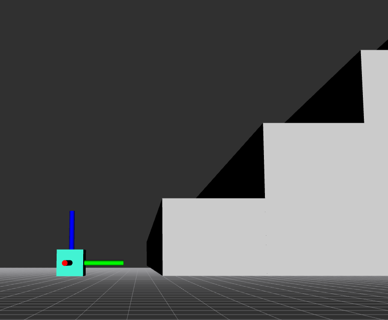
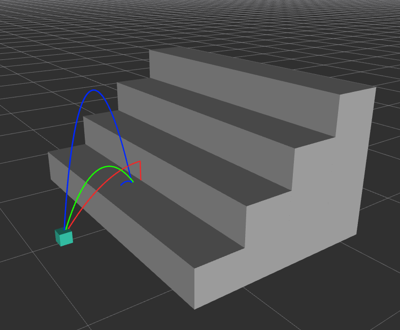

# Up the Stairs Gazebo & Gym Environment
[](https://ros.org/) [](https://www.python.org/downloads/release/python-3810/)


This package is a toy example environment simulated in Gazebo with a Gym-Wrapper for effect-centric discrete action learning where the robot is given a continuous action/motion space repertoire and has to learn reliable discrete actions which produce distinct effects in the environment. For more detailed information on the method, see our paper [*Unsupervised Learning of Effective Actions in Robotics*][paper].

 <p float="center">
  <figure>
        
        
    </figure> 
</p>

This repository offers two identical simulated environments in Gazebo once with continuous action space and once with the option to pre-set a collection of discrete actions which can be used to test other action space discretization methods.

## Installation
The easiest way to get this package to run is to build a singularity container using the [up_the_stairs.def](singularity/up_the_stairs.def) file. This sets up the necessary ROS-Noetic configurations in order to run the environment. In case you want to run it locally make sure to install ROS-Noetic and all the necessary ros packages listed in the [up_the_stairs.def](singularity/up_the_stairs.def) file.

Afterwards you have to clone this git repository into the src folder of a new catkin workspace and build it: 

```bash
mkdir -p catkin_ws/src
cd catkin_ws/src
git clone https://github.com/marko-zaric/up-the-stairs.git
cd ..
catkin build
source devel/setup.bash
```

Next you have to install the required Python modules and the [*ActionPrototypeGenerator*][actprogen] if you want to use the action space discretization method proposed in [*Unsupervised Learning of Effective Actions in Robotics*][paper]:

```bash
pip install -r requirements.txt
pip install git+https://github.com/marko-zaric/action-prototype-gen.git
```

Now you should be good to go!

## Usage
This section describes how to recreate the results from the paper [*Unsupervised Learning of Effective Actions in Robotics*][paper]. The package is very modular which allows easy modification for alternative use via the wide variety of ROS services.

### Motion Sampling
In order to start the sampling process one first has to launch the four-step Gazebo environment:
```bash
roslaunch up_the_stairs four_steps.launch
```
This exposes two services for data collection:

- up_the_stairs/rollout
- up_the_stairs/rollout_gaussian

Both services sample motions in the four step environment and store the (motion, effect)-tuples in a .csv file upon completion. Internally this uses the *jumper* service which performs the actual jump in the Gazebo simulator.

The *up_the_stairs/rollout*  service samples uniformly over a given action space range and the *up_the_stairs/rollout_gaussian* samples motions based on a defined Normal distribution.

### Action Prototype Generation
The *four_step.launch* file also exposes a service to directly generate action prototypes using the [*ActionPrototypeGenerator*][actprogen] effect-centric discretization. The service is called */up_the_stairs/action_prototype_generator* and takes in a environment name and the resulting file name which stores the action prototypes as a *.npy* file.

To configure the parameters of the Action Prototype Generator adjust the [config.yaml](data/prototypes/up_the_stairs_v1/config.yaml) which can be found in the *data/prototypes/* folder. 

### Training RL Agent
This package provides the option to directly train a DQN StableBaselines3 RL agent on the discrete Up The Stairs environment or a SAC StableBaselines3 RL agent on the continuous Up The Stairs environment. The following table explains the various potential RL agent configuration options:

| Name| RL Algorithm | discrete/continuous  | ROS-Node | Configuration  |
|---|---|---|---|---|
| Effect-based Action Prototypes  | DQN  | discrete  | dqn.py | [dqn.yaml](rl/dqn.yaml)  |
| Uniform Action Prototypes  | DQN  | discrete  | dqn.py  | [dqn.yaml](rl/dqn.yaml)   |
| Random Action Prototypes  | DQN  | discrete  | dqn_random.py  | [dqn_random.yaml](rl/dqn_random.yaml)  |
| Continuous Control Agent  | SAC  | continuous  | sac.py  | [sac.yaml](rl/sac.yaml)  |

All the *.yaml configuration files* where you can select the mode at the top (train or eval). Depending on the selection either the train or run/eval sections take effect.

The easiest way to start training after sucessful configuration in *.yaml* is to use the *auto_train.launch* file and passing the respective algorithm node script in the *rl* argument. Example for SAC:

```bash
roslaunch up_the_stairs auto_train.launch rl:='sac.py'
```
(default is *dqn.py*)
## License
This project is licensed under a Creative Commons Attribution 4.0 International License - see the [LICENSE](LICENSE) file for details.

## Acknowledgements
This research was funded in whole or in part by the Austrian Science Fund (FWF) [ELSA, DOI: 10.55776/I5755]. For open access purposes, the author has applied a CC BY public copyright license to any author accepted manuscript version arising from this submission.


[paper]: <https://airov.at>
[actprogen]: <https://github.com/marko-zaric/action-prototype-gen>